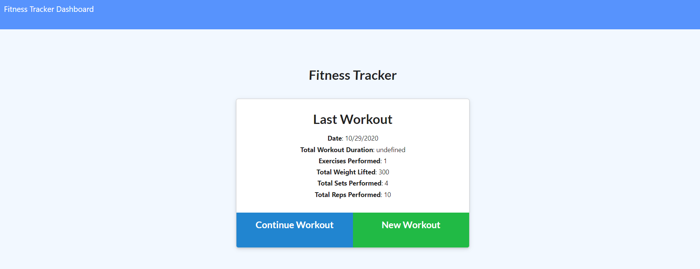
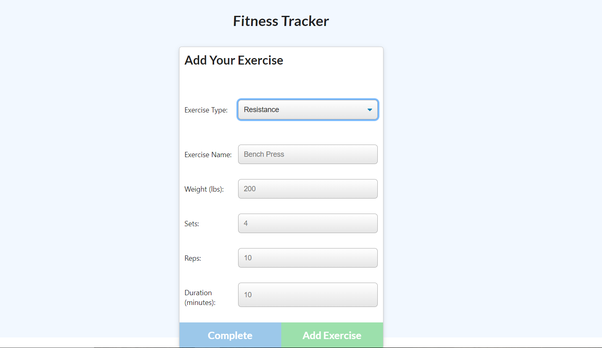
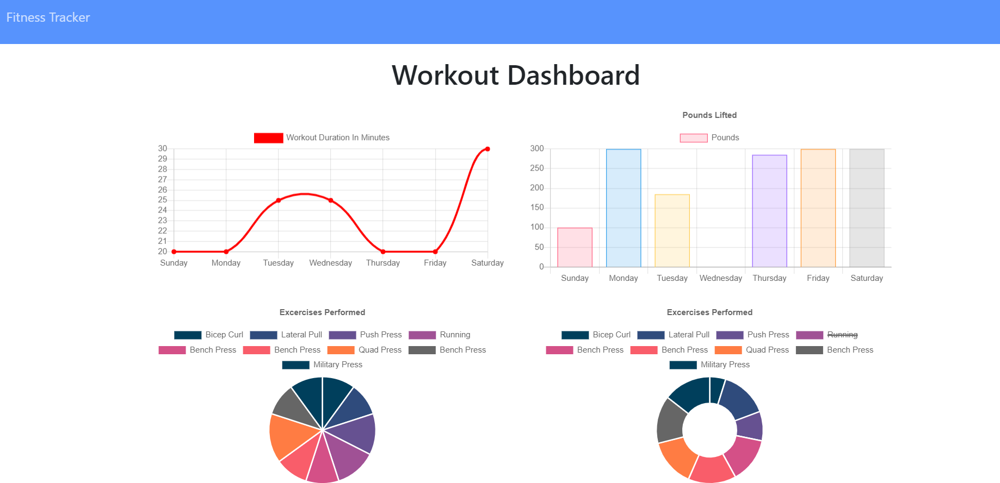

# HM17-Tracker

### Heroku Link: https://shrieking-beast-86108.herokuapp.com/

### GitHub Repo: https://github.com/AldoCarrillo/HM17-Tracker

## Description

What this project does is a fitness trackers of all of your workouts with all the exercises in it. you can see all the info in a database.

-   Workouts
    -       Date
    -       Exercises

You can Continue a workout or create a new one then you can add exercises to your workouts.

## Table of contents

-   [Installation](#installation)
-   [Usage](#usage)
-   [Test](#test)
-   [Credits](#credits)
-   [License](#license)
-   [Questiones](#Questiones)

## Installation

Run the terminal the main file called "server.js" with Node or use the deployed app on heroku.

## Usage

-   To Add a new WorkOut, click green button in the index page.
-   To Contonue with the last workout, click blue botton in the indexpage.
-   To add a exercise for a work out fill the info the click add exercise
-   To complete a exercise clic botton completed
-   To display the info click in dashboard top left to display graphics of all of your workout.

## Main Page

#### New Workout

      * Add a new workout
      * Select Exercise
      * Fill the Exercise info
      * Add Exercise

#### Continue Workout

      * Continue with a workout
      * Select Exercise
      * Fill the Exercise info
      * Add Exercise or complete exercise

## Test

"Node server.js"

Go to http://localhost:3000/ or heroku app

Add a new workout

click dashboard top left

## Credits

-   Aldo Carrillo

## License

MIT License

Copyright (c) 2020 Aldo Carrillo

Permission is hereby granted, free of charge, to any person obtaining a copy
of this software and associated documentation files (the "Software"), to deal
in the Software without restriction, including without limitation the rights
to use, copy, modify, merge, publish, distribute, sublicense, and/or sell
copies of the Software, and to permit persons to whom the Software is
furnished to do so, subject to the following conditions:

The above copyright notice and this permission notice shall be included in all
copies or substantial portions of the Software.

THE SOFTWARE IS PROVIDED "AS IS", WITHOUT WARRANTY OF ANY KIND, EXPRESS OR
IMPLIED, INCLUDING BUT NOT LIMITED TO THE WARRANTIES OF MERCHANTABILITY,
FITNESS FOR A PARTICULAR PURPOSE AND NONINFRINGEMENT. IN NO EVENT SHALL THE
AUTHORS OR COPYRIGHT HOLDERS BE LIABLE FOR ANY CLAIM, DAMAGES OR OTHER
LIABILITY, WHETHER IN AN ACTION OF CONTRACT, TORT OR OTHERWISE, ARISING FROM,
OUT OF OR IN CONNECTION WITH THE SOFTWARE OR THE USE OR OTHER DEALINGS IN THE
SOFTWARE.

## Questiones

-   GitHub link: https://github.com/AldoCarrillo
-   Email: aldo.carrillo22@gmail.com
